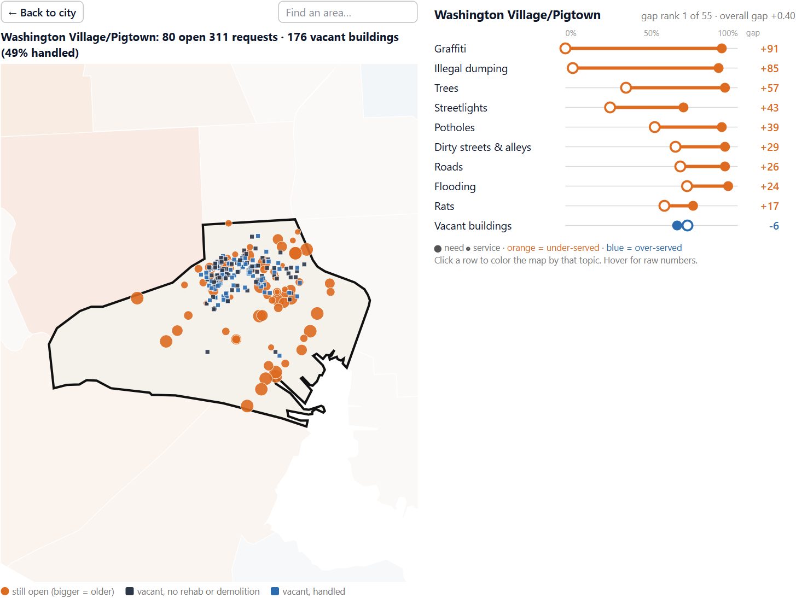

# Baltimore Triage

**Where is Baltimore bad, and the city not responding?** A [marimo](https://marimo.io) notebook that doubles as a web app. It scores all 55 Community Statistical Areas on need vs service across 10 topics, then zooms from the whole city down to the street address of every still-open request.

**Live site:** [https://xpw1337.github.io/HopHacks26/](https://xpw1337.github.io/HopHacks26/)

HopHacks 2026 · marimo Data Visualization track. Source: [github.com/xpw1337/HopHacks26](https://github.com/xpw1337/HopHacks26).



## Run it locally

The app is a single Python file with every dependency pinned in its PEP 723 header. You do not need to create a virtualenv by hand. Follow **macOS** or **Windows** below.

`--sandbox` is required. Without it, marimo asks “Run in a sandboxed venv?” and can abort in a non-interactive terminal. The first run downloads the pinned packages (`marimo`, `polars`, `altair`, `shapely`, `scikit-learn`, and the rest listed at the top of `script.py`). That can take a few minutes. Later runs reuse the sandbox.

The committed snapshot in `data/` is required for a first run. Do not delete `data/demo_call/` — those audio files are the voice-intake demo.

### macOS

1. Open **Terminal** (Spotlight: `Cmd+Space`, type `Terminal`, press Return).

2. Confirm Python 3.11+ and Git. On Mac the command is `python3`, not `python`:

```bash
python3 --version
git --version
```

If Git is missing, install Apple’s command-line tools when prompted, or run `xcode-select --install`. If Python is older than 3.11, install uv in the next step and then run `uv python install 3.12`.

3. Install [uv](https://docs.astral.sh/uv/):

```bash
curl -LsSf https://astral.sh/uv/install.sh | sh
```

macOS uses zsh by default. Load uv into this Terminal session, then confirm it worked:

```bash
source $HOME/.local/bin/env
uv --version
uvx --version
```

New Terminal windows pick this up automatically. If `uv` is still “command not found”, quit Terminal fully and open it again.

4. Clone the repo and start the web app (code hidden — this is the product):

```bash
git clone https://github.com/xpw1337/HopHacks26.git
cd HopHacks26
uvx marimo run --sandbox script.py
```

To edit the notebook with code visible:

```bash
uvx marimo edit --sandbox script.py
```

5. Open the URL marimo prints, usually **http://localhost:2718**. If that port is taken:

```bash
uvx marimo run --sandbox --port 2720 script.py
```

Headless check that the notebook is valid:

```bash
uvx marimo check script.py
```

6. To rebuild the parquet files from the live Open Baltimore APIs (about 2 minutes, needs internet), keep `data/demo_call/` and `data/areas.geojson` and only remove the snapshot tables:

```bash
rm data/requests_311.parquet data/housing.parquet data/snapshot_meta.json
uvx marimo run --sandbox script.py
```

The notebook notices the missing files and downloads a fresh snapshot.

### Windows

1. Open **PowerShell**. Confirm Python 3.11+ (`python --version`).

2. Install [uv](https://docs.astral.sh/uv/):

```powershell
powershell -ExecutionPolicy ByPass -c "irm https://astral.sh/uv/install.ps1 | iex"
```

Close PowerShell and open a new window so `uv` and `uvx` are on your PATH. Check with `uv --version`.

3. Clone the repo and start the web app (code hidden — this is the product):

```powershell
git clone https://github.com/xpw1337/HopHacks26.git
cd HopHacks26
uvx marimo run --sandbox script.py
```

To edit the notebook with code visible:

```powershell
uvx marimo edit --sandbox script.py
```

4. Open the URL marimo prints, usually **http://localhost:2718**. If that port is taken:

```powershell
uvx marimo run --sandbox --port 2720 script.py
```

Headless check that the notebook is valid:

```powershell
uvx marimo check script.py
```

5. To rebuild the parquet files from the live Open Baltimore APIs (about 2 minutes, needs internet):

```powershell
Remove-Item data/requests_311.parquet, data/housing.parquet, data/snapshot_meta.json
uvx marimo run --sandbox script.py
```

The notebook notices the missing files and downloads a fresh snapshot.

### What you should see

- A sidebar on the left with section links, the **Fix days** slider, time window, need denominator, and topic weights
- The city map, then the rest of the story as you scroll
- A live-counts banner at the top if you have internet; if you do not, the snapshot still loads and a note says live data is unavailable

It works **offline**. Analysis always uses the saved snapshot (`data/requests_311.parquet`, `data/housing.parquet`, `data/areas.geojson`, dated 2026-09-18). The live banner is the only network call, and a failure there does not stop the app.

**Share a view:** add `?area=` to the URL, for example `http://localhost:2718/?area=Cherry%20Hill`.

### Optional helper scripts

Same commands on macOS and Windows, from the repo root:

```bash
# Reproduce the alley-wait / neglect-probe numbers written up in neglect_plan.md
uv run scripts/neglect_probe.py

# Rebuild the voice-intake mp3s (needs an ElevenLabs API key; the committed files already work)
uv run scripts/make_call_demo.py
```

## What's in the app

One file, `script.py`, is both the notebook and the site. The sidebar stays on screen while you scroll. Topic-weight sliders re-rank every panel that depends on them.

| Section | What it does |
| --- | --- |
| **Executive summary** | Need vs service vs neglect gap, in a few sentences |
| **Problem statement** | Why complaint volume, agency silos, and council districts miss compound neglect; related-work box |
| **Data overview** | The 9 Open Baltimore / BNIA layers, row counts, and the 10 scored topics |
| **Triage Explorer (2D map)** | Custom anywidget: click a Community Statistical Area to zoom to its streets. Orange dots are still-open 311 requests (bigger = older); vacant buildings are squares |
| **Gap Card** | Need–service dumbbells for the picked area. Click a topic row to recolor the map by that topic alone |
| **Neglect skyline (3D)** | Same weighted gap as tower height. Drag to rotate, scroll to zoom, click an area to pin it |
| **Work list** | Oldest still-open requests (or vacant notices) in the picked area, with addresses and a CSV download |
| **Organization response** | Per-agency 0–100 scores for the picked area vs that agency's own citywide pace |
| **Need vs service scatter** | All 55 areas; bottom-right is the priority corner |
| **Robust top 10** | Areas that stay in the top 10 under at least 80% of 2,000 random topic-weightings |
| **Worse than they look** | High vacancy (inspector-written) but few resident 311 calls — silence that looks like satisfaction |
| **The fix clock** | Animated survival curves: if you report it today, when does it get fixed? Still-open requests are not dropped from the clock |
| **A resident calls it in** | Pre-recorded 311-style audio next to that topic/area's real close rates |
| **While the alley waits** | Dirty alleys left open vs cleared fast, and nearby rat reports |
| **The unison call** | Neighborhood close-times as a staged sequence |
| **Try it on your own block** | Pick a topic and CSA; get the same clock the map uses |
| **Insight synthesis** | What the current weights say about the city |
| **Monday morning** | Open requests 7–30 days old, ranked by chance they are still open 21 days from now |
| **Take it to the meeting** | Dispatch CSV of the current ranking and each area's three widest topic gaps |
| **Discussion** | Limits, misuse, future work |
| **marimo feedback / AI notes** | What the tool and the coding agent got right and wrong |
| **Appendix** | Loaders, scoring, data-quality checks |

**Sidebar controls** (every one changes a conclusion):

- **Rank time still open over the first *n* days** — default 7
- **Time window** — all of 2026 so far, last 180 days, or last 90 days
- **Count 311 need** — per 1,000 residents or per 1,000 parcels
- **Topic weights** — 0 to ignore a topic; vacant buildings always use parcels

**Topics scored** (need and service for each): vacant buildings, streetlights, potholes, roads, illegal dumping, dirty streets & alleys, rats, graffiti, trees, flooding.

## What's in the repo

| Path | What it is |
| --- | --- |
| `script.py` | The notebook and app: story, custom map/skyline widgets, scoring, organization scores, checks |
| `app.css` | App styling (hero, section headings, sidebar, tables, maps) |
| `data/requests_311.parquet` | 2026 311 snapshot used for need, the fix clock, and organization scores |
| `data/housing.parquet` | Vacant notices, rehabs, demolitions, parcels |
| `data/areas.geojson` | 55 Community Statistical Area boundaries |
| `data/snapshot_meta.json` | Snapshot date, row counts, dropped-row counts |
| `data/demo_call/` | Cached voice-intake audio (`*.mp3`) and `transcript.json` |
| `docs/app.png` | Screenshot used in this README |
| `scripts/neglect_probe.py` | Offline tests: neglect vs crime and every 311-topic pair |
| `scripts/make_call_demo.py` | Regenerates `data/demo_call/` (ElevenLabs; not needed to run the app) |
| `Bmore_plan.md` | Project plan, method, and judging rubric |
| `neglect_plan.md` | Write-up of the alley-wait / “does neglect cause harm?” probe |
| `pair_review.md` | Full topic-pair matrix from the neglect probe |
| `agent_log.md` | Notes on using an AI coding agent: what helped, what went wrong |
| `marimo_feedback.md` | Notes on marimo features, bugs, and requests |
| `F26 HopHacks Prize + Sponsors Information.pdf` | HopHacks prize/sponsor sheet |

## The method in one paragraph

**Need** is how bad things are (resident 311 reports per 1,000 residents; open vacancy notices per 1,000 parcels).
**Service** is how well the city responds *as a share of that need*: for 311, how long a typical request stays
open (the share of the first 7 days already closed, read off the same time-to-fix clock as a single resident
call); for vacancy, the share of vacant buildings rehabbed or torn down since 2023; plus proactive city tickets
per resident report. Measuring service as a share, not a count, stops the worst areas from looking well served
just because they have the most problems. **Neglect** is not the difference between the two: service is regressed
on need within each
topic, and the score is how far *below* that fitted line an area sits, so it cannot just restate the need map.
Subtracting instead ranked areas at Spearman +0.88 with need alone. 2,000 random weightings show which areas stay
in the top 10 no matter what you care about.

## Organization response scores

Selecting a CSA on the map also updates an organization response section. For each organization and issue
component, it compares the local share of resident requests closed within the current **Fix days** setting with
that organization's citywide rate for the same component. The local-minus-citywide result is percentile-ranked
against comparable CSA/component cells; those component scores are then weighted by eligible request count into a
0–100 organization score. A score near 50 is typical after controlling for the organization and component, while
a higher score means the organization is resolving that area's requests faster than its usual citywide pace.

Only requests old enough to have received the full fix window count, and organization/component cells with fewer
than 10 eligible requests are not scored. Proactive tickets and known bulk administrative closes are excluded.
The responsibility table is derived from the `Agency` assigned on Baltimore's 311 records. It describes observed
routing—not legal responsibility—and a component can be split among multiple organizations.
